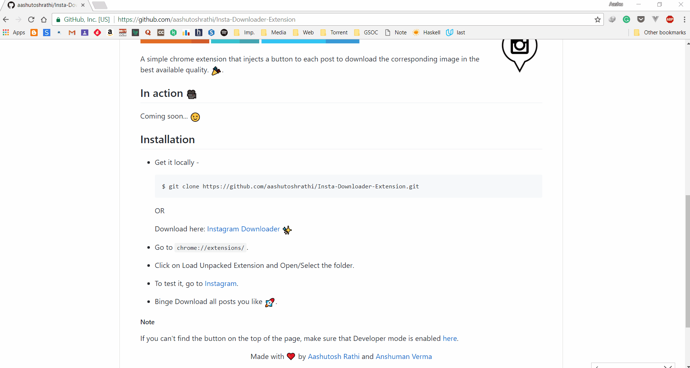

# Instagram Downloader

[](https://github.com/aashutoshrathi/Insta-Downloader-Extension)

[](http://forthebadge.com)
[](http://forthebadge.com)
[](http://forthebadge.com)

A simple chrome extension that injects a button to each post to download the corresponding image/video in the best available quality. :tada:.


## In action :movie_camera:




## Installation

 - Get it locally - 
   ```sh
   $ git clone https://github.com/aashutoshrathi/Insta-Downloader-Extension.git
   ```

   **OR** 

   Download the latest version here: [Instagram Downloader ✨](https://github.com/aashutoshrathi/Insta-Downloader-Extension/archive/master.zip)

 - Go to `chrome://extensions/`.
 - Click on Load Unpacked Extension and Open/Select the folder.

   
 - To test it, go to [Instagram](https://www.instagram.com).
 - Binge Download all posts you like :rocket:.


##### Note

If you can't find the button on the top of the page, make sure that Developer mode is enabled [here](https://developer.chrome.com/extensions/faq#faq-dev-01).


<p align="center"> Made from scratch with ❤ by <a href="https://github.com/aashutoshrathi">Aashutosh Rathi</a> and <a href="https://github.com/anshumanv">Anshuman Verma</a> </p>
